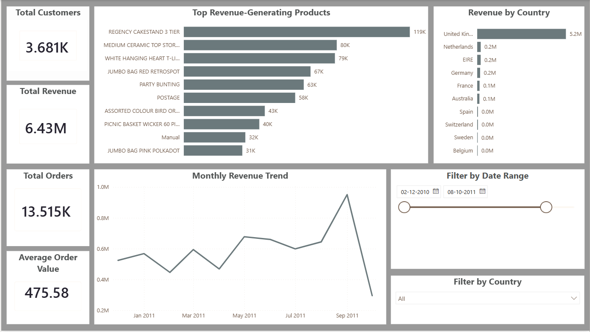

# CustomerDNA Analytics Dashboard

## Project Overview

This project analyzes retail transaction data to uncover customer purchasing patterns, revenue trends, and top-performing products.

The workflow combines SQL, Python, and Power BI to transform raw transaction data into business insights and an interactive dashboard.

---

## Tools Used

- Python
- Pandas
- NumPy
- Matplotlib
- Seaborn
- MySQL
- Power BI

---

## Project Workflow

### 1. Data Cleaning
- Removed missing Customer IDs
- Handled null values
- Converted data types
- Created Revenue column

### 2. SQL Analysis
- Loaded cleaned data into MySQL
- Performed revenue analysis
- Country-wise sales analysis
- Product performance analysis
- Monthly trend analysis

### 3. Power BI Dashboard
- KPI Cards
  - Total Revenue
  - Total Customers
  - Total Orders
  - Average Order Value

- Interactive Filters
  - Country Filter
  - Date Range Filter

- Visualizations
  - Revenue Trend Over Time
  - Revenue by Country
  - Revenue by Product

---

## Key Insights

- United Kingdom generated the highest revenue.
- Revenue peaked during the final quarter of 2011.
- A small number of products contributed a significant share of revenue.
- Customer purchasing behavior varies across countries.

---

## Dashboard Preview

---

## Repository Structure

CustomerDNA-Analytics/
│
├── notebooks/
├── sql/
├── powerbi/
├── screenshots/
└── README.md
